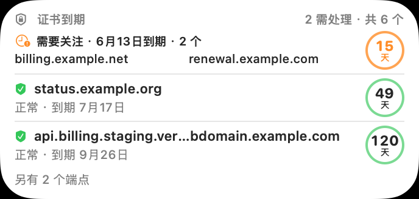
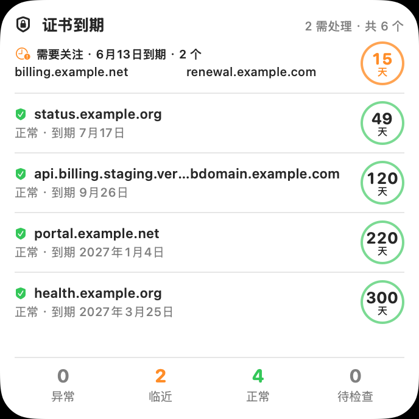

# CertGlance

**Mac 桌面的 TLS 证书到期看板与小组件。**

CertGlance 在系统桌面小组件中快速呈现最需要关注的证书；宿主 App 提供多端点图形看板、管理、主动检查和本地通知授权。界面使用 macOS 原生 SwiftUI 组件与系统语义颜色。

## 功能范围

- 自动小尺寸展示当前最需要关注的证书；固定端点小尺寸可添加多份，每份在系统编辑界面单独选择一个已监控的域名与端口。中尺寸按风险展示最多三个端点或同日到期组；大尺寸展示最多六个端点或日期组及状态分布。日期组只合并显示，检查与提醒仍逐端点进行。
- 宿主看板以状态总览、紧凑焦点圆环和单列端点列表展示检查结果，支持搜索与“需处理”筛选；圆环对应证书完整有效期比例，天数和到期日同步展示，失败时可查看最近成功时间与连续失败次数。可粘贴带路径的 HTTPS URL，也支持 `域名:端口`，同一域名的不同 HTTPS 端口独立监控。旧数据缺少端口时按 443 读取。
- 使用系统 TLS 信任结果读取 HTTPS 证书到期时间，区分已过期、不受信任与检查失败，不把网络错误误报为健康。
- 本地提醒默认提前 30／7／1 天，可在原生设置中调整；Widget 时间线预排天数变化、分批检查端点，实际运行仍受 macOS 调度与通知权限影响，新构建的投递需重新验收。
- 不监控域名注册到期、网站可用率，也不自动续签证书。

## 小组件预览

以下图片由仓库的固定假数据离屏生成，只展示排版；不包含真实用户域名，也不代表系统图库或桌面 WidgetKit 的实机效果。

| 自动小号 | 自动中号 | 自动大号 |
| --- | --- | --- |
|  |  |  |

## 项目状态

**较早构建已在一台 Mac 上通过签名安装与基础功能实机验收；当前源码构建号为 10，主界面共享快照同步尚待安装验收；详情入口此前已在实机出现，但键盘、VoiceOver、可调提醒投递及新版小组件的完整回归仍待逐项验收。**源码包含自签名文件桥接、真实 TLS 检查、默认可调整的 30／7／1 天提醒与自动小／中／大尺寸及固定小尺寸 Widget。手动 GitHub Actions 可生成非公证 DMG；CI 静态签名通过不等于新构建的小组件、跨进程文件共享或系统通知投递已在用户电脑上通过。小组件刷新由 macOS 调度，不能作为全天候生产告警的唯一渠道。

Xcode 工程与 scheme 沿用内部名称 `SSLWidget`，正式宿主 Bundle ID 为 `com.HongXunPan.CertGlance`，Widget Bundle ID 为 `com.HongXunPan.CertGlance.Widget`。技术边界见[工程代码技术选型](docs/工程代码技术选型.md)。

## 开发验证

在本目录运行：

```sh
bash scripts/check-certglance.sh
xcodebuild -project SSLWidget.xcodeproj -scheme SSLWidget -destination 'platform=macOS' -derivedDataPath .build/DerivedData CODE_SIGNING_ALLOWED=NO build
```

无签名构建仅证明源码和工程能编译，不能证明系统小组件注册、共享文件桥接和通知投递可用。父仓 `scripts/verify.sh` 另可做双架构与真实域名网络冒烟。

## 安装候选

手动工作流 [CertGlance 正式候选打包](.github/workflows/certglance.yml) 使用项目专用自签名证书生成双架构、非公证 DMG，不自动发布 Release。首次安装、系统安全提示、签名校验、运行态验收和已知升级限制见[正式候选验收](docs/正式候选验收.md)。不要把假数据 PoC DMG 当成正式 App，也不要用 Finder 拖拽覆盖已安装的旧版作为已支持升级方式。

证书检查会连接用户添加的端点，配置与检查记录保存在当前账户本机。数据范围、通知内容与清除方式见[隐私与数据](docs/隐私与数据.md)。

## 签名文件共享实验

独立的 [WidgetKit 共享 PoC](PoC/WidgetSharing/README.md) 只使用假数据，曾验证自签名宿主与小组件能否访问同一专用文件。它保留为升级与共享诊断工程，与正式 CertGlance 的 Bundle ID、数据目录和打包工作流隔离；其运行态结果不能代替正式应用验收。

## 开源许可

本项目采用 [MIT 许可证](LICENSE)。

## 参与与反馈

开发约定见[贡献指南](CONTRIBUTING.md)；使用问题见[支持说明](SUPPORT.md)，安全漏洞请按[安全策略](SECURITY.md)私密报告。仓库协作遵守[社区行为准则](CODE_OF_CONDUCT.md)。普通 Pull Request 会执行不接触签名密钥的无签名检查；签名 DMG 仍由维护者手动打包与验收。
